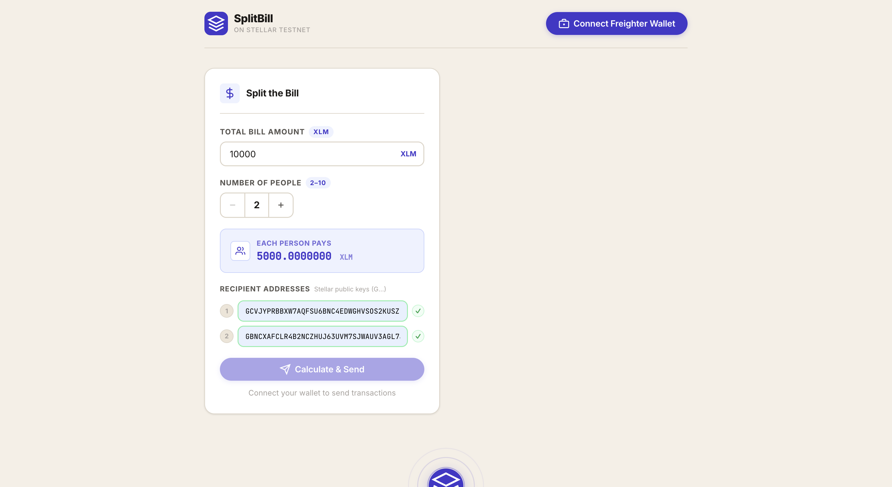
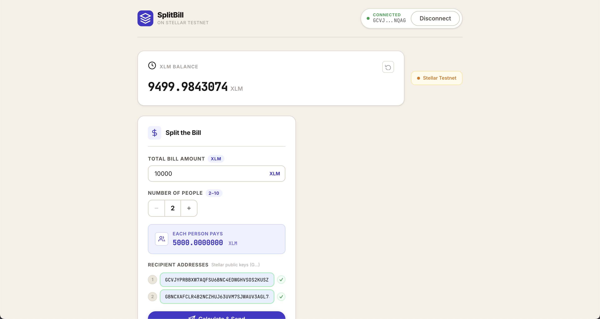
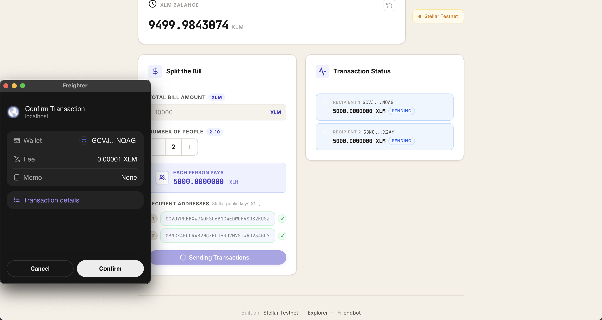
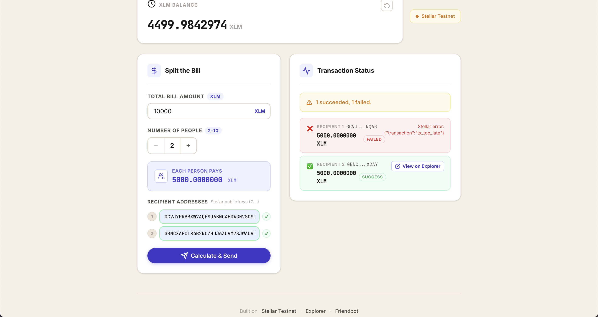
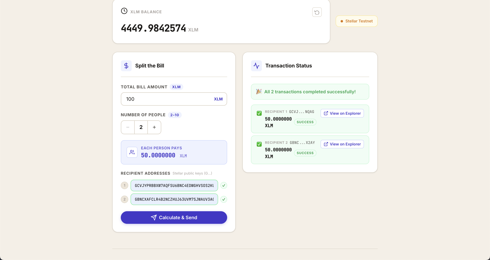

# SplitBill

A decentralized bill-splitting app built on the Stellar Testnet. Connect your 
Freighter wallet, enter a bill, and automatically split payments in XLM.

## Tech Stack

- React + Vite
- Stellar SDK v12
- Freighter Wallet API v2

## Setup Instructions

1. **Install Freighter browser extension:** https://www.freighter.app/
2. **Switch Freighter to Testnet mode:** Settings → Network → Testnet
3. **Fund your wallet via Friendbot:** https://laboratory.stellar.org/#account-creator?network=test
4. **Clone this repo and run:**

```bash
git clone https://github.com/YOUR_USERNAME/split-bill-calculator
cd split-bill-calculator
npm install
npm run dev
```

5. Open http://localhost:5173

## Screenshots

### Wallet Connected State


### Balance Displayed


### App Interface


### Successful Testnet Transaction


### Transaction Result Show to User


## How It Works

1. Connect your Freighter wallet (Testnet mode required)
2. Enter the total bill amount in XLM
3. Set the number of people splitting the bill
4. Enter each recipient's Stellar public address (starts with G)
5. Click **Calculate & Send** — Freighter will prompt you to sign each transaction
6. Track real-time status for each payment with links to the Stellar explorer

## Error Scenarios Handled

| Scenario | Message Shown |
|---|---|
| Freighter not installed | Link to install Freighter |
| User rejects signing | "Transaction cancelled by user." |
| Recipient not funded | "Recipient account does not exist on testnet." |
| Insufficient balance | "Insufficient XLM balance." |
| Network error | "Network error. Please check your connection." |

## Links

| Resource | URL |
|---|---|
| Freighter Docs | https://docs.freighter.app |
| Stellar SDK Docs | https://stellar.github.io/js-stellar-sdk |
| Horizon Testnet API | https://horizon-testnet.stellar.org |
| Stellar Lab | https://laboratory.stellar.org |
| Testnet Explorer | https://stellar.expert/explorer/testnet |
